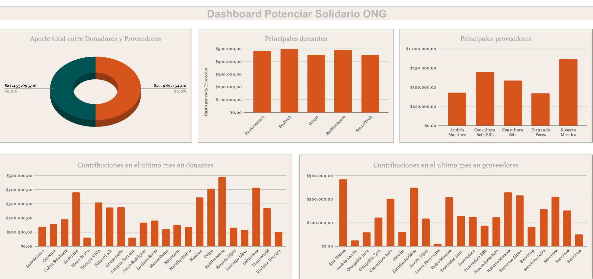
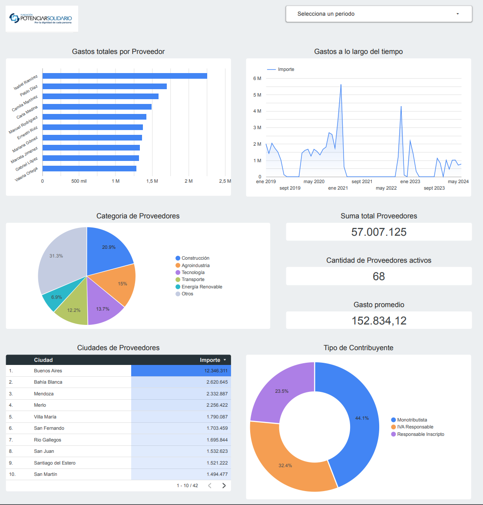
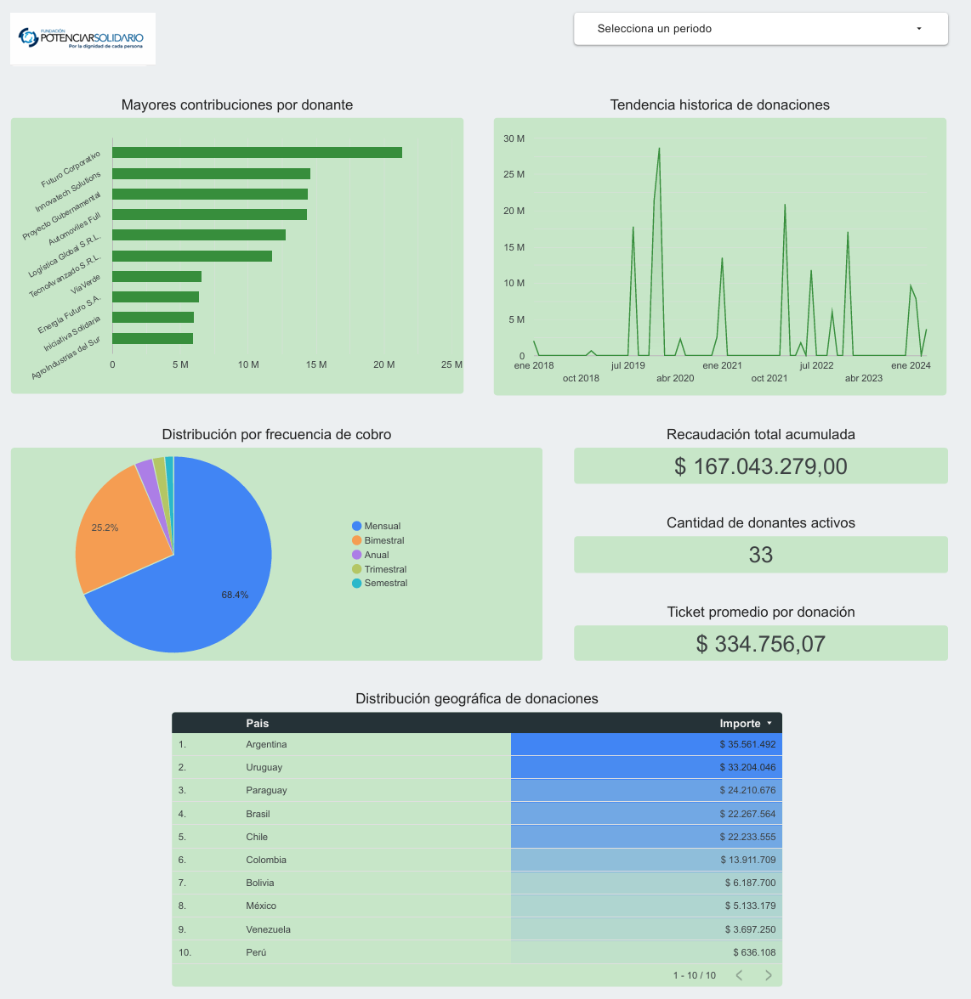
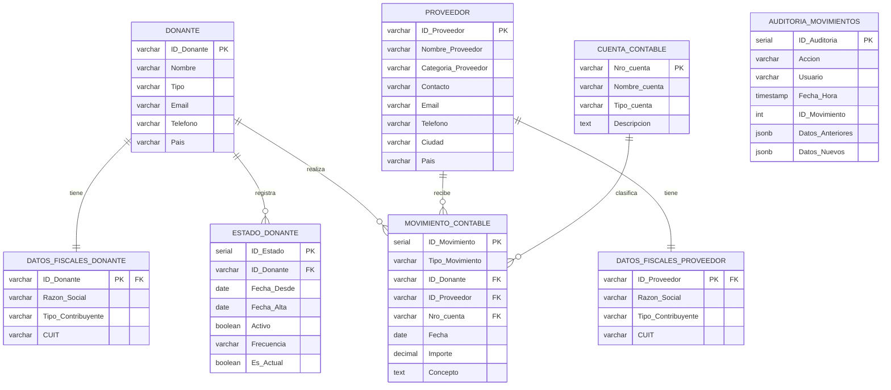

# ONG Analytics System

Pipeline de datos para gestión contable de organizaciones sin fines de lucro.


---

## El Problema

Datos contables de una ONG en Excel desorganizados: sin normalización, sin integridad referencial y sin trazabilidad de cambios. El desafío fue transformar esto en un sistema confiable para la toma de decisiones.

---

## La Evolución

### Sprint 1: Primer Acercamiento.

El proyecto consistió en la ingesta de datos provenientes de archivos .xlsx y .csv desorganizados. El proceso técnico incluyó la limpieza y normalización de la información para asegurar la integridad de los datos. Posteriormente, se transformaron en tablas dinámicas dentro de Google Sheets, las cuales sirvieron como motor principal para el desarrollo de un dashboard interactivo, cumpliendo con el requerimiento técnico de migrar el flujo de trabajo de Excel a Sheets.

**Herramientas**: Google Sheets + Excel.

**Resultado**: Dashboard básico con datos limpios.

**[Ver dashboard en Google Sheets](https://docs.google.com/spreadsheets/d/1G3ReiW9rNJCDpYEeYT7x1DleLM82mc6qT6nqEKmhgOA/edit?usp=sharing)**




**Qué aprendí**: La importancia crítica de la integridad de los datos antes del análisis. Un archivo con datos mezclados, formatos inconsistentes y registros desordenados es imposible de mantener. Dedicar tiempo a estructurar y limpiar la información es el único camino para obtener resultados confiables en un dashboard.

### Sprint 2: Dashboard Profesional.

Nuevos archivos, más datos, más complejidad: movimientos contables, plan de cuentas con 44 cuentas, donantes y proveedores. Aquí escalé a Looker Studio para un dashboard interactivo y profesional. El proceso de limpieza y normalización siguió la misma metodología del Sprint 1, pero a mayor escala.

**Herramientas**: Looker Studio + Google Sheets + Excel.

**Resultado**: Dashboard con KPIs, filtros interactivos y visualizaciones.

**[Ver dashboard en Looker Studio](https://lookerstudio.google.com/reporting/f41cdd19-4981-401d-86e9-0dd185bf14d0)**





**Decisiones de visualización**:
- KPI cards para métricas clave (un vistazo al estado financiero).
- Gráfico de líneas para tendencias temporales (continuidad visual).
- Barras horizontales para rankings (legibilidad de nombres largos).
- Tabla de detalle para transparencia total (drill-down).

Ver [dashboard/README.md](dashboard/README.md) para el análisis completo de cada visualización.

### Iniciativa Propia: Base de Datos Escalable.

El dashboard funcionaba, pero los datos vivían en Google Sheets. Por iniciativa propia (no era requerido en el curso), construí un pipeline completo con PostgreSQL para demostrar que el proyecto puede escalar a producción.

**Herramientas**: PostgreSQL + Python + Pandas.
**Resultado**: 7 tablas normalizadas, sistema de auditoría, carga incremental.


## Diagrama ER



**Features**:
- 7 tablas normalizadas con foreign keys y constraints.
- Sistema de auditoría con JSONB (todo cambio queda registrado).
- Triggers de validación (solo un estado activo por donante).
- Carga incremental con detección de duplicados.
- 8 vistas analíticas predefinidas.
- Procedimientos para baja/reactivación de donantes.

Ver los scripts SQL y la guía de instalación en [`database/`](database/)

---

## Pipeline de Datos

```
Camino(Engineering):
Excel → Python/Pandas → CSVs procesados → PostgreSQL
```

**Nota**: La base de datos PostgreSQL se construyó a partir de los archivos procesados del Sprint 2, demostrando que el proyecto puede escalar más allá de Google Sheets.
---


## Estructura del Proyecto:

```
ONG/
├── README.md                    # Este archivo
├── LICENSE
├── .gitignore
├── .env.example                 # Template para variables de entorno
├── requirements.txt             # Dependencias de Python
├── data/
│   └── raw/
│       ├── sprint1/            # Archivos originales Sprint 1
│       └── sprint2/            # Archivos originales Sprint 2
├── database/                    # Scripts SQL
│   ├── 01_schema.sql           # 7 tablas normalizadas
│   ├── 02_cuentas.sql          # 44 cuentas contables
│   ├── 03_vistas.sql           # 8 vistas analíticas
│   ├── 04_functions.sql        # Procedimientos y triggers
│   └── 05_auditoria.sql        # Sistema de auditoría JSONB
├── scripts/                     # ETL
│   ├── separar_datos.py        # Normalización de hojas Excel
│   └── cargar_datos.py         # Carga incremental a PostgreSQL
├── dashboard/                   # Visualización
│   └── README.md               # Análisis de visualizaciones
├── docs/                        # Documentación
│   ├── ER.md                 # Diagrama ER en Mermaid
└── procesados/                  # CSVs normalizados
```

---

## Tecnologías

| Componente | Tecnología |
|------------|------------|
| Base de datos | PostgreSQL 18 |
| ETL | Python 3.11+ / Pandas |
| Diagramas | Mermaid |

---

## Instalación Rápida

```bash
pip install -r requirements.txt
cp .env.example .env    # configurá tu contraseña
psql -U postgres -d ong_contabilidad -f database/01_schema.sql
python scripts/cargar_datos.py
```

---

## Decisiones de Diseño

1. **Normalización desde cero**: Datos originales sin estructura → modelo relacional.
2. **Validaciones en base de datos**: Constraints para garantizar integridad.
3. **Bitemporal pattern**: Historial completo de cambios de estado.
4. **Auditoría con JSONB**: Registro flexible de cambios.
5. **Carga incremental**: Solo se insertan datos nuevos, sin duplicados.
6. **Escalabilidad**: PostgreSQL para futuro (no era requerido en el curso).

---


## Licencia

MIT
